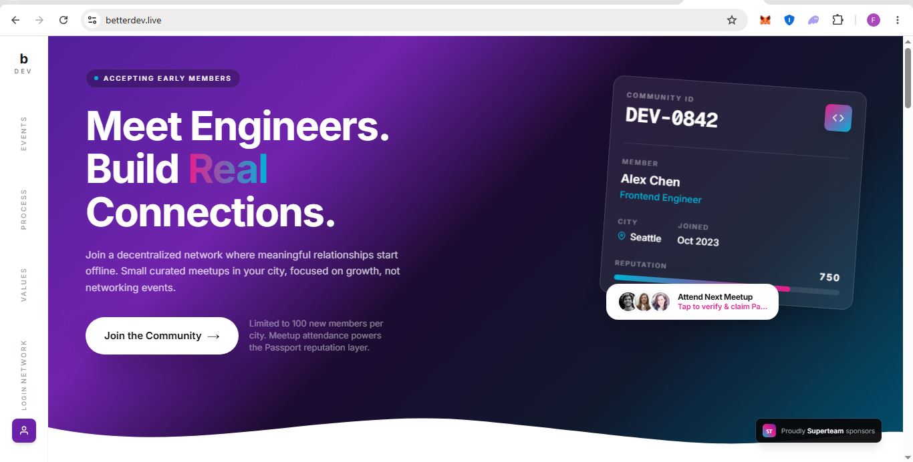

# BetterDev

**BetterDev is a chain-agnostic reputation and coordination protocol for real-world engineering communities.**

**Members receive a Community ID, build portable reputation through verified participation, and use the Passport layer to prove contribution across meetups and future ecosystem opportunities.**

Built with love ❤️ for engineers who prefer real connections over passive feeds.

<p align="center">
  <a href="https://youtu.be/J2hxoah5kTw?si=e_Js907PNw-wrJnQ">
    <strong>▶ FOUNDER'S INTRO</strong>
    <br /><br />
    
  </a>
</p>

<p align="center">
  <a href="https://betterdev.live">
    
  </a>
  &nbsp;&nbsp;
   <a href="https://youtu.be/rL1mjW4Y0e8?si=7iXzbD_2HblrGHcd">
    
  </a>
  &nbsp;&nbsp;
  <a href="docs/protocol-architecture.md">
    
  </a>
  &nbsp;&nbsp;
  <a href="https://github.com/BetterDevOrg/protocol">
    
  </a>
</p>

<p align="center">
  
  
  
</p>

---

## Overview

BetterDev helps engineers move from passive online networking into **verified real-world participation**. Members join local chapters, receive a **Community ID**, log in with email, and build reputation through meetups, contributions, and community coordination.

BetterDev is **Arbitrum-first**, not Arbitrum-only — identity and reputation belong to the member, not to a single wallet or chain.

Full protocol design: [`docs/protocol-architecture.md`](docs/protocol-architecture.md)

---

## Features

- **Community ID** — portable member identity and invite links
- **Member login** — email verification and profile at [`/login`](https://betterdev.live/login)
- **BetterDev Passport** — on-chain credential and reputation layer
- **Meetup participation** — verified attendance and reputation events
- **Builder Circles** — fair group coordination powered by Chainlink VRF (roadmap)

### Product layers

1. **Identity** — Community ID, Passport, multi-chain wallet registry (protocol design)
2. **Reputation** — attendance, profile, referrals, publications
3. **Coordination** — Builder Circles and meetup tooling

### Member RSVP & Builder Circles

1. RSVP from the meetup page at `/meetup/[slug]`.
2. After the organizer runs matching, open `/meetup/[slug]/circles`.
3. View your assigned Builder Circle and its members.

Matching uses the RSVP, city, or hybrid participant pool selected by the
organizer. QR check-in records attendance only; it does not determine matching
eligibility. See [Builder Circles](docs/BUILDER-CIRCLES.md) for the complete
organizer and member flow.

---

## Tech stack

| Area | Stack |
|------|--------|
| App | Next.js 15, React 19, Tailwind CSS |
| Chain | Arbitrum Sepolia, ethers.js, Hardhat |
| Randomness | Chainlink VRF |
| Storage | Google Sheets (MVP) · optional Supabase |

Smart contracts: `BetterDevPassport`, `ReputationRegistry`, `MeetupRegistry`, `BuilderCircleVRF`

---

## Quick start

For local development you need Node.js 20+ and a copy of the environment template.

```bash
git clone https://github.com/BetterDevOrg/protocol.git
cd protocol
npm install
cp .env.example .env.local
# Fill in .env.local — never commit this file
npm run dev
```

Open [http://localhost:3000](http://localhost:3000)

### Scripts

| Command | Purpose |
|---------|---------|
| `npm run dev` | Development server |
| `npm run build` | Production build |
| `npm run lint` | ESLint |
| `npm run contracts:compile` | Compile Solidity |
| `npm run contracts:test` | Run contract tests |
| `npm run contracts:deploy:sepolia` | Deploy to Arbitrum Sepolia |

Environment variables are listed in [`.env.example`](.env.example). **Do not commit secrets** (private keys, API tokens, session secrets).

---

## Project structure

```text
src/app/          Next.js routes and API
src/components/   UI components
src/lib/          Shared logic
contracts/        Solidity protocol
scripts/          Deploy and integration scripts
docs/             Protocol and project documentation
```

---

## Documentation

| Document | Description |
|----------|-------------|
| [Protocol Architecture](docs/protocol-architecture.md) | Identity model, on/off-chain boundary, roadmap |
| [Internship Projects](docs/INTERNSHIP-PROJECTS.md) | Contributor tracks for interns and newcomers |
| [Contributing](CONTRIBUTING.md) | How to contribute |
| [Governance](GOVERNANCE.md) | Maintainers and decision-making |
| [Code of Conduct](CODE_OF_CONDUCT.md) | Community standards |
| [Security](SECURITY.md) | Responsible disclosure |
| [`.env.example`](.env.example) | Environment variable template (placeholders only) |

## Maintainers

| Maintainer | GitHub |
|------------|--------|
| Frankeze | [@FrankezeCode](https://github.com/FrankezeCode) |
| Ruth | [@BetterRuth](https://github.com/BetterRuth) |

---

## Contributing

We welcome contributions. See [CONTRIBUTING.md](CONTRIBUTING.md) for setup and pull request guidelines.

Look for issues labeled **`good first issue`** on [GitHub Issues](https://github.com/BetterDevOrg/protocol/issues). See [Internship Projects](docs/INTERNSHIP-PROJECTS.md) for structured tracks.

---

## Security

If you discover a security issue, **do not open a public GitHub issue**. See [SECURITY.md](SECURITY.md) for responsible disclosure.

---

## License

[MIT](LICENSE) © BetterDev

---

## Links

- **Website:** [betterdev.live](https://betterdev.live)
- **Member login:** [betterdev.live/login](https://betterdev.live/login)
- **Repository:** [github.com/BetterDevOrg/protocol](https://github.com/BetterDevOrg/protocol)
- **Issues:** [github.com/BetterDevOrg/protocol/issues](https://github.com/BetterDevOrg/protocol/issues)
